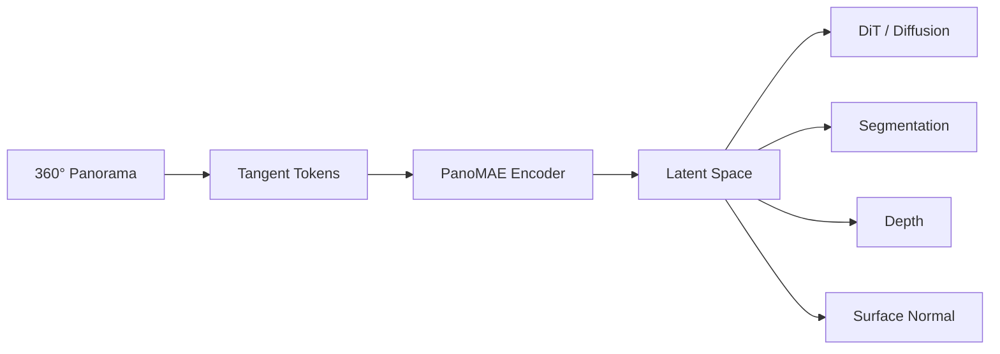

<!-- =========================================================
     GitHub Profile README · Tech Edition
     Author: Shan Hefu
     Repository: shengruduzhou/shengruduzhou
========================================================== -->

  
  
  
  

  
  
  
  

---

## `// SYSTEM PROFILE`

| `RESEARCH` | `VISION` | `ENGINEERING` | `LANGUAGES` |
|:---:|:---:|:---:|:---:|
| PanoMAE · DiT | 360° · Dense Prediction | AI · Full Stack | 中文 · 日本語 · English |

> Building geometric visual representations and production-ready AI systems.

---

## `// RESEARCH PIPELINE`

---

## `// CORE STACK`

 

---

## `// PROJECT NODES`

---

## `// CONTRIBUTION ACTIVE`

<!-- Generated daily by .github/workflows/profile-assets.yml -->

 

 

<picture>
  <source media="(prefers-color-scheme: dark)" srcset="./assets/contribution-snake-dark.svg" />
  <source media="(prefers-color-scheme: light)" srcset="./assets/contribution-snake.svg" />
  
</picture>

<strong>Open development telemetry</strong>

 

<!--START_SECTION:waka-->
<!--END_SECTION:waka-->

---

## `// CONNECT`

  

<code>RESEARCH://PANORAMIC_AI</code> · <code>BUILD://FULL_STACK</code> · <code>SHIP://RELIABLE_SYSTEMS</code>

