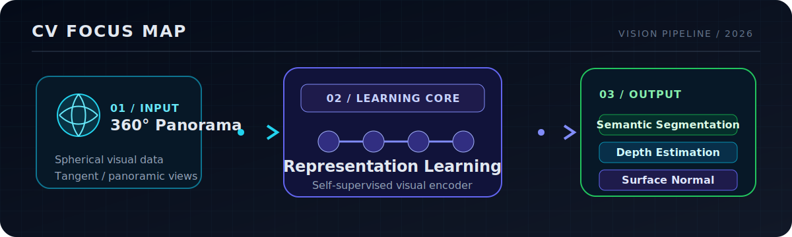
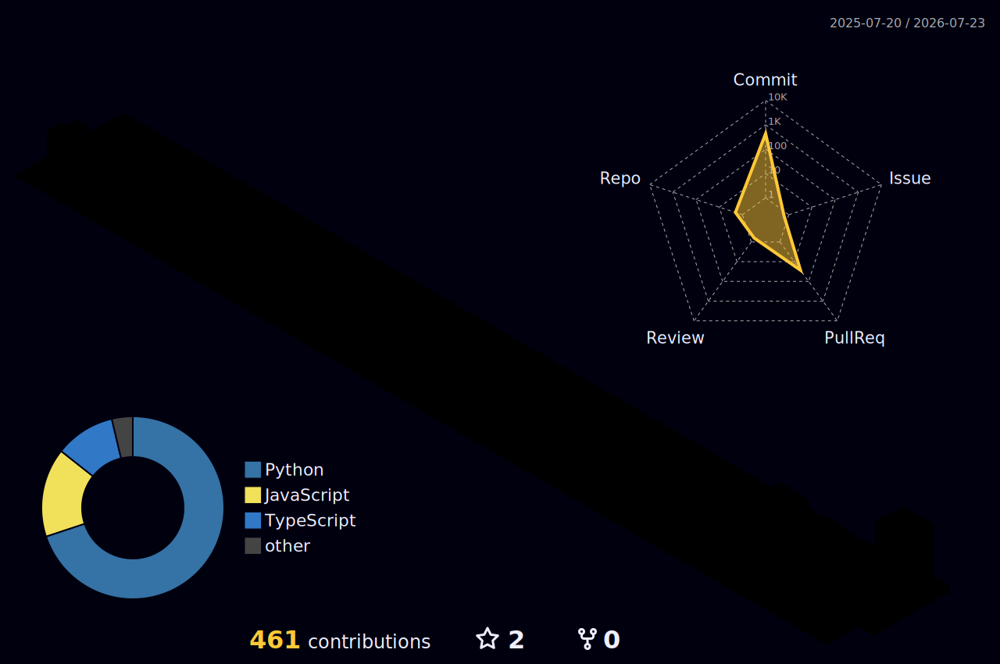

<div align="center">



<h1>Hi there, I'm Shan Hefu 👋</h1>

<h3>タン カクフ · M.S. in Computer Science at Sophia University, Tokyo</h3>

<a href="https://readme-typing-svg.demolab.com">
  
</a>

<p>
  
  
  
  
</p>

<p>
  <a href="https://shanhefu-portfolio.vercel.app/"></a>
  <a href="https://shengruduzhou.github.io/"></a>
  <a href="https://shengruduzhou.github.io/about%20me/2025/06/05/Introduction.html"></a>
  <a href="mailto:shanhefu@gmail.com"></a>
</p>

</div>

---

## `// ABOUT ME`

<table>
<tr>
<td width="60%" valign="top">

I am a Computer Science master's student at **Sophia University** working at the intersection of **computer vision**, **machine learning**, and **production-oriented software engineering**.

My current work focuses on **panoramic and spherical visual data**, with strong interest in **self-supervised learning**, **representation learning**, and **dense visual prediction**. I also build practical AI systems and full-stack tools that carry research into usable products.

</td>
<td width="40%" valign="top">


<br /><br />

<br /><br />

<br /><br />


</td>
</tr>
</table>

---

## `// FOCUS MAP`

<div align="center">



</div>

---

## `// CORE STACK`

<div align="center">


<br /><br />


</div>

---

## `// PROJECT NODES`

<div align="center">

<a href="https://github.com/shengruduzhou/FormulaForge">
  
</a>
<a href="https://github.com/shengruduzhou/shengruduzhou.github.io">
  
</a>

</div>

---

## `// CONTRIBUTION ACTIVE`

<div align="center">


<br />



<br />

<a href="https://github.com/shengruduzhou">
  
</a>
<a href="https://github.com/shengruduzhou">
  
</a>

<br />


<picture>
  <source media="(prefers-color-scheme: dark)" srcset="./assets/contribution-snake-dark.svg" />
  <source media="(prefers-color-scheme: light)" srcset="./assets/contribution-snake.svg" />
  
</picture>

</div>

---

## `// DEVELOPMENT TELEMETRY`

<div align="center">


</div>

> Detailed development telemetry covering coding time, languages, editors, active projects, operating systems, contribution rhythm and repository composition.

<details open>
<summary><strong>OPEN DEVELOPMENT TELEMETRY</strong></summary>

<br />

<!--START_SECTION:waka-->

```txt
Total Time: 22 hrs 8 mins

Other        30 hrs 23 mins  ██████████████▒░░░░░░░░░░   57.86 %
Bash         11 hrs 43 mins  █████▓░░░░░░░░░░░░░░░░░░░   22.33 %
Python       8 hrs 12 mins   ████░░░░░░░░░░░░░░░░░░░░░   15.63 %
TypeScript   1 hr 24 mins    ▓░░░░░░░░░░░░░░░░░░░░░░░░   02.68 %
Markdown     46 mins         ▒░░░░░░░░░░░░░░░░░░░░░░░░   01.47 %
```

<!--END_SECTION:waka-->

</details>

---

## `// CONNECT`

<div align="center">

<a href="mailto:shanhefu@gmail.com"></a>
<a href="https://linkedin.com/in/hefu-shan-054b24361/"></a>
<a href="https://shanhefu-portfolio.vercel.app/"></a>

<br /><br />


</div>


